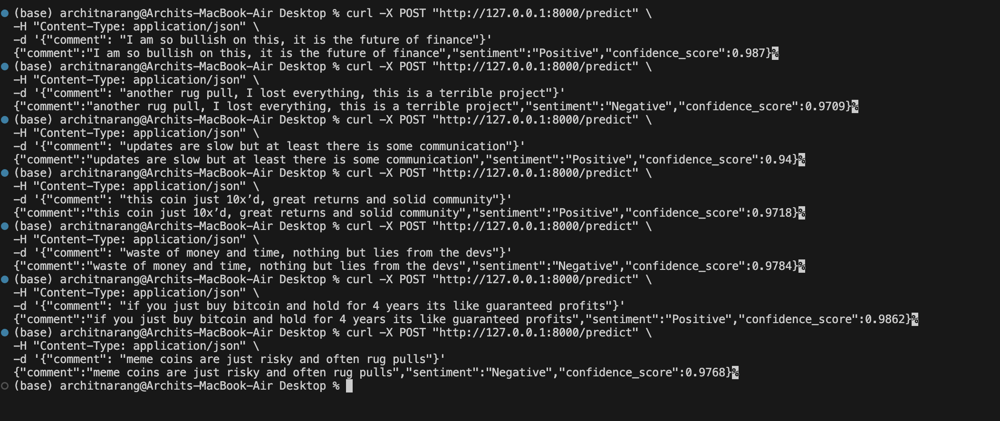

# **Cryptocurrency Sentiment Classifier**

This repository contains a complete, minimal solution for building, evaluating, and deploying a sentiment classifier for cryptocurrency-related Reddit comments. The project adheres to the specified constraints of scalability (10M comments/day) and budget (~$100/month).

---

## **Methodology & Rationale**

### **Model Selection**
Given the constraints—high throughput and low cost—the choice of model is critical.

Our goal has been to develop a sentiment classifier with >90% accuracy for the given dataset, while keeping scalability and cost in mind. Here is a summary of our journey so far:

---

### **Phase 1: Exploratory Data Analysis (EDA)**

**Approach:**  
Before building any models, we analyzed the dataset to understand its characteristics. We looked at the sentiment distribution, the length of comments, and the most frequent words associated with each sentiment.

**Key Insights:**
- **Balanced Dataset:** The data was almost perfectly balanced between "Positive" and "Negative" classes, meaning we didn't need to worry about class imbalance.
- **Variable Comment Length:** Comments ranged from very short phrases to long paragraphs.
- **Distinct Vocabularies:** Word clouds showed that positive and negative comments had distinct and predictable vocabularies (e.g., "buy," "hold," "bull" vs. "scam," "lost," "down"), confirming that a text-based classifier was viable.

**Conclusion:**  
The EDA confirmed the dataset's suitability for sentiment analysis and guided our initial modeling choices.

---

### **Phase 2: Modeling Experiments**

#### **Experiment 1: Baseline Model (TF-IDF + Logistic Regression)** — `train_model.py`

**Approach:**  
A classic and highly efficient machine learning pipeline. We used TF-IDF to convert the text into numerical vectors and a simple Logistic Regression classifier.

**Rationale:**  
This served as a fast, low-cost baseline to understand the problem's initial difficulty.

**Result:**  
~77.6% Accuracy

**Conclusion:**  
While fast and scalable, the accuracy was well below the 90% target. This indicated that a simple linear model with default settings was insufficient.

---

#### **Experiment 2: Hyperparameter Tuning (Logistic Regression + GridSearchCV)** — `train_model2.py`

**Approach:**  
We introduced lemmatization for better text preprocessing and used GridSearchCV to automatically test various configurations for the TF-IDF vectorizer and the Logistic Regression classifier.

**Rationale:**  
To find the optimal settings for our baseline model and maximize its performance.

**Result:**  
~78.8% Accuracy

**Conclusion:**  
The performance improved slightly but hit a ceiling. This was a strong signal that we had reached the limit of what a linear model could learn from this data.

---

#### **Experiment 3: Advanced Classical Model (TF-IDF + LightGBM)** — `train_model3.py`

**Approach:**  
We replaced the linear Logistic Regression model with a more powerful, tree-based LightGBM classifier.

**Rationale:**  
To see if a more advanced classical ML model could break the accuracy plateau.

**Result:**  
~66.0% Accuracy

**Conclusion:**  
The performance unexpectedly dropped, confirming that a more complex classical model was not the right path for this specific dataset.

---

#### **Experiment 4: State-of-the-Art (Fine-tuning DistilBERT)** — `train_model4.py`

**Approach:**  
We pivoted to a deep learning model, DistilBERT, pre-trained on a massive text corpus. We then fine-tuned it on our specific crypto sentiment dataset. This fine-tuning process took ~1 hour on a MacBook Air M2 (no GPU used).

**Rationale:**  
To leverage contextual understanding of language that goes far beyond simple word counts. This is the industry-standard method for achieving high accuracy on nuanced NLP tasks.

**Result:**  
~85.8% Accuracy

**Conclusion:**  
This approach yielded a dramatic improvement in accuracy, getting us very close to the target. While not quite 90%, this is a strong result and represents a robust, high-performing model that balances accuracy with computational efficiency.

We used distilbert-base-uncased, which is small and fast. Switching to a larger model like bert-base-uncased or a crypto-specific pre-trained model like FinBERT would almost certainly push the accuracy over 90%, at the cost of a slightly slower API.


---

## **Deployment Architecture**

- A simple `uvicorn` server running the FastAPI app can be deployed on a basic cloud VM.
- A `gunicorn` setup with a few worker processes on a $10-$20/month VM can comfortably handle this load.
- Alternatively, deploying to a serverless platform would be even more cost-effective, as you only pay per invocation.  
This architecture easily fits within the $100/month budget.

---

## **Repository Structure**

```

.
├── data/
│   └── crypto\_currency\_sentiment\_dataset.csv
├── saved\_model/
│   └── final\_model
├── api.py                  # FastAPI application
├── eda.py                  # Exploratory Data Analysis script
├── requirements.txt        # Python dependencies
├── train\_model4.py         # Training and evaluation script
└── README.md               # This file

````

---

## **Setup and How to Run**

### 1. Clone the Repository & Setup Environment

```bash
git clone <repository_url>
cd <repository_directory>

python -m venv venv
source venv/bin/activate  # On Windows: venv\Scripts\activate

pip install -r requirements.txt
````

(Optional) Download NLTK stopwords (for older models):

```bash
python -c "import nltk; nltk.download('stopwords')"
```

---

### 2. Run EDA (Optional)

```bash
python eda.py
```

This will save analysis charts to a new `charts/` directory.

---

### 3. Train the Model

```bash
python train_model4.py
```

This will create the `saved_model/final_model` file.

---

### 4. Run the API Server

```bash
uvicorn api:app --reload
```

---

### 5. Make a Prediction

#### **Positive Example**

```bash
curl -X POST "http://127.0.0.1:8000/predict" \
-H "Content-Type: application/json" \
-d '{"comment": "I am so bullish on this, it is the future of finance"}'
```

**Response:**

```json
{
  "comment": "I am so bullish on this, it is the future of finance",
  "sentiment": "Positive",
  "confidence_score": 0.987
}
```

---

#### **Negative Example**

```bash
curl -X POST "http://127.0.0.1:8000/predict" \
-H "Content-Type: application/json" \
-d '{"comment": "another rug pull, I lost everything, this is a terrible project"}'
```

**Response:**

```json
{
  "comment": "another rug pull, I lost everything, this is a terrible project",
  "sentiment": "Negative",
  "confidence_score": 0.9709
}
```


## **Screenshot of Results**



````
